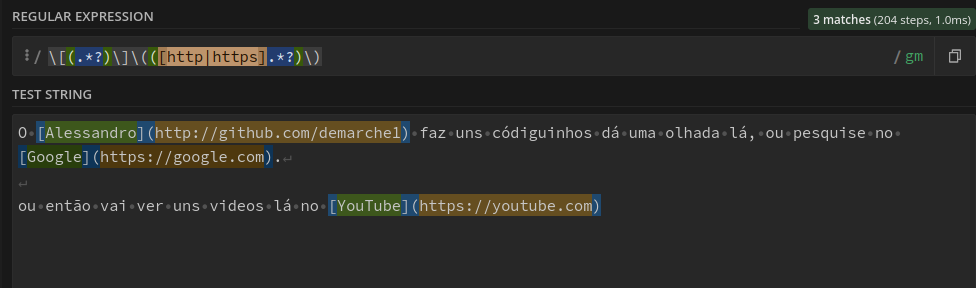

/^\d{3}.\d{3}.\d{3}-\d{2}/gm

a regex vai dar match com as 2 linhas de números abaixo

195.321.559-90
654.610.128-41
184.697.619.03

- "^" afirma a posição no início de uma linha;
- "\d" afirma que quero dar match com digitos(o mesmo que [0-9]);
- "{3} {2}" da match na expressão anterior na quantidade de vezes informada entre chaves. Ou seja quero 3 digitos.
- "$" afirma a posição no final de uma linha, evita processamento desnecessário.

/[.-]/gm

A expressão acima vai dar match em tudo que estiver dentro de "[]" (é case sensitive).

"[]" Colchetes seria como o "OU". Na expressão seria OU . OU -

```javascript
"195.321.559-90".replace(/[.-]/gm, "") // Result: 19532155990
```

/^(\w+),\s(\w+)$/gm

- "()" Corresponde um grupo
- "\w" Corresponde a qualquer caractere de palavra (equivalente a [a-zA-Z0-9_])
- "\s" Corresponde a qualquer caractere de espaço em branco (equivalente a [\r\n\t\f\v ])
- "+" Corresponde ao match anterior quantas vezes for necessário até não dar mais match.

Wendel, Erick
Demarche, Alessandro
Johnson, Jose

No VsCode 
replace: 
^(\w+),\s(\w+)$ por: {firstName "\$2", lastName: "\$1"}

resultado:
{firstName "Erick", lastName: "Wendel"}
{firstName "Alessandro", lastName: "Demarche"}
{firstName "Jose", lastName: "Johnson"}

```javascript
/\[(.*?)\]\(([http|https].*?)\)/gm
```

```javascript 
"[(.*?)\]" // Busca tudo que estiver dentro de "[]" até encontrar o próximo caracter especial.
``` 

```javascript
"\(\)" // Expressão literal para conseguir usar o que 
      // estiver dentro de (), por que "()" é um expressão que 
     // corresponde grupos
```

```javascript
([http|https].*?) // "[" Corresponde OU. ou seja TUDO que for OU http OU https até o próximo "]"
```

